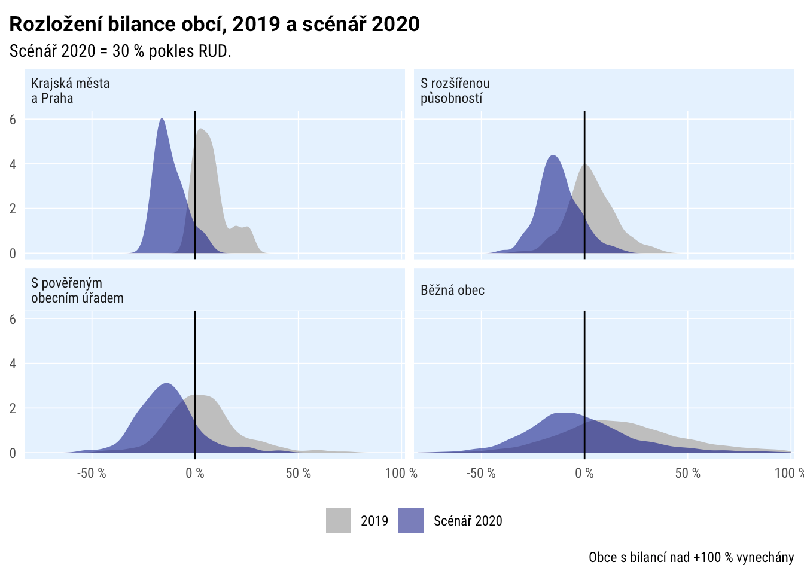
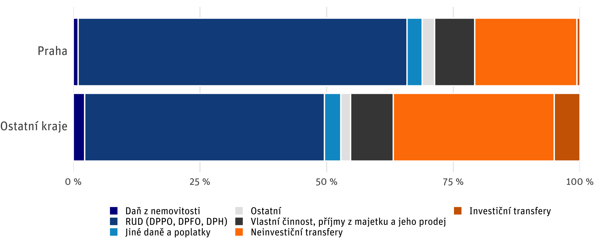
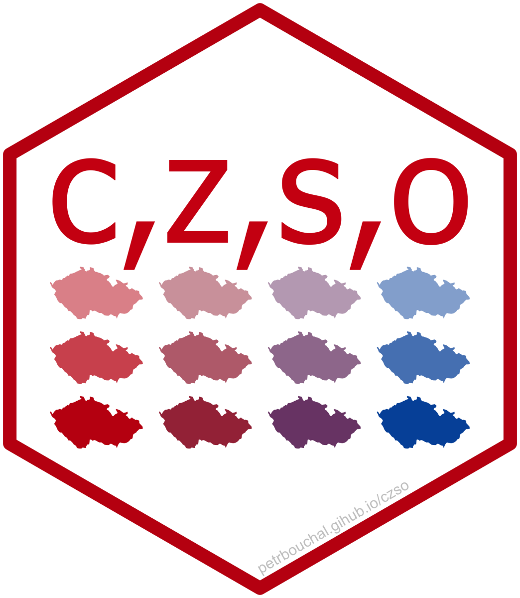

```{r setup, include=FALSE}
options(htmltools.dir.version = FALSE)
knitr::opts_chunk$set(fig.retina = 3, echo = F,
                      warning = F,
                      dev = "ragg_png",
                      fig.showtext = T,
                      message = F)
library(fontawesome)
library(tidyverse)
library(pragr)
library(ptrr)

ptrr::set_geom_defaults()
update_geom_defaults("rect", list(fill = "blue"))
```

```{r}
sysfonts::font_add_google("IBM Plex Sans", "Roboto")
sysfonts::font_add_google("IBM Plex Sans Condensed", "Roboto Condensed")
```


```{r xaringan-themer, include=FALSE, warning=FALSE}
library(xaringanthemer)
style_mono_accent(
  base_color = "#0000ff",
  header_font_google = google_font("IBM Plex Sans"),
  text_font_google   = google_font("IBM Plex Sans"),
  code_font_google   = google_font("IBM Plex Mono"),
  table_row_even_background_color = "fff"
)
```

class: left, middle, inverse

# Problém

## Neefektivní a nereprodukovatelné využití dat

---
class: left, top

.large[
 1\. najít data - někde?
]


--

.large[
 2\. nějak je načíst a zpracovat v Excelu
]


--

.large[
 3\. `data-nova-final_1-hotovo-oprava3_FIN.xlsx`
]


--

.large[
 4\. za týden nikdo neví, kde se data vzala a co jsme s nimi udělali
]


---
class: center, middle

```{r}

```


---
class: inverse, center, middle

# Co s tím
---

# Reprodukovatelná analytika

.large[Na delší povídání

Ale: pokud už s daty pracujete pomocí kódu (konkrétně jazyka R), mám pro vás způsob, jak se efektivně dostat k českým otevřeným datům

(Pokud ne, důvod navíc to zkusit.)

]

---

# Nástroje pro využití českých open dat

.large[1. Veřejné finance
2. Otevřená data ČSÚ]

---

# Veřejné finance: Monitor státní pokladny (MF ČR)

.large[Rozpočty + výsledovky + rozvahy 2010-20]

.medium[= kde berou peníze, jak je utrácejí, jak hospodaří, co vlastní

\+ další specifické údaje (dotace, financování deficitů...)]

.large[Ministerstva, příspěvkovky, obce, městské části]

---

# Monitor Státní pokladny

.large[

= [webové rozhraní](https://monitor.statnipokladna.cz) + [open data](https://monitor.statnipokladna.cz/datovy-katalog/)

open data: 

- velké množství
- holá data s kódy
- relativně složité využití
- nutnost rozumět číselníkům
]

---
class: large
# Balík [{statnipokladna}](https://monitor.statnipokladna.cz/datovy-katalog/transakcni-data) v R
--

rychlé načtení vyčištěných dat Státní pokladny

--

snadný výběr organizace/obce (nebo jejich množiny

--

snadné doplnění číselníků ("dekódování dat")

--

možnost kombinovat různé typy dat

--

kód = záznam postupu => snadné zopakovat

--

.large[[dokumentace vysvětlující](https://petrbouchal.github.io/statnipokladna/articles/how-the-data-works.html) i strukturu a obsah dat]

---

# {statnipokladna}

.large[

Přijato do oficiálního repozitáře software pro jazyk R (CRAN) 

Dokumentace [petrbouchal.github.io/statnipokladna](https://petrbouchal.github.io/statnipokladna)

]

```{r, out.width="200px"}

```


---

### Příklad 1: simulace dopadu ekonomické krize na obce 

<!--  -->
```{r}

```

---

### Příklad 2: analýza příjmů obecních rozpočtů 

<!--  -->
```{r}

```

---
# Otevřená data ČSÚ

.large[ČSÚ část dat poskytuje formou otevřených dat]

.medium[= konzistentní, strojově zpracovatelné soubory]

.medium[\+ katalog]

.large[cca 600 datových sad]

---

### Příklad

<!--  -->

```{r}
knitr::include_graphics("konjunk.png")
```


---
layout: true

### Kde se to vzalo

---
```{r echo=T, eval=F, message=FALSE, warning=FALSE, results="html"}
library(czso)
library(tidyverse)

czso_get_catalogue() %>% 
  filter(str_detect(title, "[Kk]onjunk|[Dd]ůvě")) %>% 
  select(dataset_id, title, description)
```

```{r echo=F, message=FALSE, warning=FALSE, results="html"}
library(czso)
library(tidyverse)

czso_get_catalogue() %>% 
  filter(str_detect(title, "[Kk]onjunk|[Dd]ůvě")) %>% 
  select(dataset_id, title, description) %>% 
  gt::gt() %>% 
  gt::as_raw_html()
```


---

```{r, message=F, echo=T, eval = F, results="html"}
czso_get_table("070013") %>% head()
```

```{r, message=F, echo=F, eval=T, results="html"}
czso_get_table("070013") %>% 
  head() %>% 
  gt::gt() %>%
  gt::as_raw_html()
```

---
layout: false

## R balík {czso}

.large[

Přijato do oficiálního repozitáře software pro jazyk R (CRAN) 

Dokumentace [petrbouchal.github.io/czso](https://petrbouchal.github.io/czso)

```{r out.width="200px"}

```


]

---
layout: true
class: inverse

# Další cesty k (nejen) českým datům v R

---
layout: false

## [{CzechData}](https://jancaha.github.io/CzechData) od @JanCaha

.medium[

přístup především k prostorovým datům o ČR od ČÚZK (administrativní hranice i topografie)

]

.pull-left[
```{r mapa-czech, echo=T, eval = F}
library(CzechData)
library(mapview)

load_RUIAN_settlement("554782", "volebni okrsky") %>% 
  mapview()
```
]

.pull-right[

```{r ref.label="mapa-czech"}

```


]


---

## [{RCzechia}](https://cran.r-project.org/package=RCzechia) od @JindraLacko

.medium[

též přístup k datům ČÚZK, číselníkům a geokódovacímu rozhraní ČÚZK (souřadnice <=> adresy)

]

.pull-left[

```{r, echo=TRUE, eval = T, fig.asp=.5}
library(RCzechia)
vnitro <- geocode("náměstí Hrdinů 1634/3, Praha 4")
mapview(vnitro)
```

]
.pull-right[
```{r zeleznice, echo = T, eval = T, fig.asp=.5}
zeleznice() %>% mapview::mapview()
```
]


---

## [{pragr}](https://petrbouchal.github.io/pragr) [experimentální] 

.large[

pro přístup k mapovým podkladům IPR Praha (historické mapové podklady, územní plán, technické a tematické výkresy) a další utility pro práci s pražskými daty

]
---
class: top, left

### [{pragr}](https://petrbouchal.github.io/pragr)

```{r map-load, include=F, eval=T}
prg_hranice <- load_RUIAN_settlement(pragr::prg_kod)
```

.pull-left[
```{r map-orto, eval = F, echo=T}
prg_hranice %>% 
  ggplot() +
  prg_tile(prg_hranice, buffer = 200) +
  geom_sf(data = prg_hranice, 
          alpha = 0.3, fill = "white", 
          colour = "white", size = 3) +
  theme_void()
```
]
.pull-right[
```{r, ref.label="map-orto", echo = F, out.width="600px", out.height="400px", fig.width=6, fig.height=4}
```
]


---
class: top, left

### [{pragr}](https://petrbouchal.github.io/pragr)

```{r map-load-kata, include=F, eval=T}
prg_hranice <- load_RUIAN_settlement(prg_kod)
katastr <- load_cadastral_territory(katastralni_uzemi[CzechData::katastralni_uzemi$nazev == "Nusle",]$kod)
```

.pull-left[
```{r map-1945, eval=F, echo=T}
katastr %>% 
  ggplot() +
  prg_basemap(katastr, buffer = 200,
              image_service = "cisarske_otisky_1840") +
  geom_sf(data = katastr, 
          fill = NA, 
          colour = "white", size = 3) +
  theme_void() + 
  theme(plot.margin = unit(c(0,0,0,0), "mm"))
```
]
.pull-right[
```{r, ref.label="map-1945", echo = F, out.width="400px", out.height="450px", fig.width=4.5, fig.height=4}
```
]

---

class: top, left

### [{pragr}](https://petrbouchal.github.io/pragr)


.pull-left[
```{r, echo = F, fig.asp=.7}
library(pragr)
ggplot(district_tilegram) +
  geom_sf(data = district_tilegram, fill = "blue", colour = "white") +
  theme_void() +
  geom_sf_text(aes(label = label), colour = "white")
```
]

.pull-right[
```{r, echo = F, fig.asp=.7}
ggplot(district_hexogram) +
  geom_sf(data = district_hexogram, fill = "blue", colour = "white") +
  theme_void() +
  geom_sf_text(aes(label = label), colour = "white")
```
]

---

## Srovnávací data

.large[

[{eurostat}](https://cran.r-project.org/package=eurostat) pro přístup k datům Eurostatu, včetně hranic NUTS regionů)

[{OECD}](https://cran.r-project.org/package=OECD) pro přístup k datům OECD 

Obojí používá stejnou logiku jako {czso}
]

---
layout: false

## [{eurostat}](http://ropengov.github.io/eurostat/)

.pull-left[
```{r eurostat, echo=T, eval = F, fig.asp = .6}
eurostat::get_eurostat("nama_10r_2gdp") %>%
  filter(unit == "PPS_HAB_EU") %>% 
  eurostat::add_nuts_level() %>% 
  filter(nuts_level == 2, time >= "2018-01-01") %>% 
  eurostat::label_eurostat(dic = "geo") %>%
  filter(geo %in% c("Wien", "Praha", "München", 
                    "Dresden", "Bratislavský kraj")) %>% 
  select(geo, values, time) %>% 
  ggplot() +
  geom_col(aes(values/100, geo)) +
  theme_ptrr("x", base_size = 25) +
  scale_x_percent_cz() +
  labs(title = "HDP jako podíl průměru EU",
       subtitle = "PPS na obyvatele, 2018")
```
]

.pull-right[

```{r ref.label="eurostat", fig.asp=.7}
```


]

---

## [{eurostat}](http://ropengov.github.io/eurostat/)

.pull-left[

```{r euronuts, echo=T, eval = F}
nuts <- eurostat::get_eurostat_geospatial()
ggplot()+
  geom_sf(data = nuts) +
  scale_y_continuous(limits = c(30, NA)) +
  scale_x_continuous(limits = c(-20, 45))
```

]

.pull-right[

```{r ref.label="euronuts"}
```

]

---
layout: false

## [{OECD}](https://cran.r-project.org/package=OECD)

.pull-left[
```{r oecd-data, echo=T, eval = T, cache=T}
gaag <- OECD::get_dataset("GOV_2019")
```


```{r oecd, echo=T, eval = F, cache=T}
gaag %>% 
  filter(IND %in% c("EPE_P_M"), 
         COU %in% c("NLD", "CZE", "SVK", "DEU")) %>% 
  ggplot(aes(obsTime, obsValue, group = COU)) +
  geom_line() +
  geom_point(size = 3) +
  facet_grid(cols = vars(COU)) +
  theme_ptrr("both", multiplot = T, base_size = 25) +
  labs(title = "Metodologie ex-post evaluace",
       subtitle = "ukotvení v primární leg. (OECD)")
```
]

.pull-right[

```{r ref.label="oecd", fig.asp=.7, cache=T}
```


]

---
layout: false
class: inverse

# Co z toho plyne


.large[

ekosystém jazyka R se rozrůstá o nástroje pro práci s českými veřejnými daty

jejich využití přinese nejen efektivitu, ale i udržitelnější proces

vše výše = dobrý důvod zkusit se pustit do trochy programování s daty

]

---
class: inverse, middle, center

.large[

(Tato prezentace je také reprodukovatelná: téměř všechny grafy a tabulky se generují naživo. Viz [<span style="text-decoration: underline; color: #fff">kód</span>](https://github.com/petrbouchal/petrbouchal.github.io/blob/src/static/slides/pssau2020-07/index.Rmd).)

]

---
class: inverse, bottom, right
layout: false

.large[
<a href="https://twitter.com/petrbouchal">`r fa("twitter", fill = "white")`</a> <a href="https://github.com/petrbouchal">`r fa("github", fill = "white")`</a> <a href="https://linkedin.com/in/petrbouchal">`r fa("linkedin", fill = "white")`</a> petrbouchal

pbouchal@gmail.com

]


