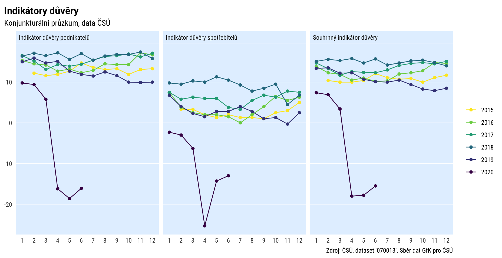

```{r setup, include=FALSE}
options(htmltools.dir.version = FALSE)
knitr::opts_chunk$set(fig.retina = 3, echo = F, warning = F)
library(fontawesome)
library(tidyverse)
library(pragr)
```

```{r xaringan-themer, include=FALSE, warning=FALSE}
library(xaringanthemer)
style_mono_accent(
  base_color = "#0000ff",
  header_font_google = google_font("IBM Plex Sans"),
  text_font_google   = google_font("IBM Plex Sans"),
  code_font_google   = google_font("IBM Plex Mono"),
  table_row_even_background_color = "fff"
)
```

class: left, middle, inverse

# Problém

## Neefektivní a nereprodukovatelné využití dat

---
class: left, top

.large[
 1\. najít data - někde?
]


--

.large[
 2\. nějak je načíst a zpracovat v Excelu
]


--

.large[
 3\. `data-nova-final_1-hotovo-oprava3_FIN.xlsx`
]


--

.large[
 4\. za týden nikdo neví, kde se data vzala a co jsme s nimi udělali
]


---
class: center, middle

```{r}
knitr::include_graphics("krugman.png")
```


---
class: inverse, center, middle

# Co s tím
---

# Reprodukovatelná analytika

.large[Na delší povídání

Ale: pokud už s daty pracujete pomocí kódu (konkrétně jazyka R), mám pro vás způsob, jak se efektivně dostat k českým otevřeným datům

(Pokud ne, důvod navíc to zkusit.)

]

---

# Nástroje pro využití českých open dat

.large[1. Veřejné finance
2. Otevřená data ČSÚ]

---

# Veřejné finance: Monitor státní pokladny (MF ČR)

.large[Rozpočty + výsledovky + rozvahy 2010-20]

.medium[= kde berou peníze, jak je utrácejí, jak hospodaří, co vlastní

\+ další specifické údaje (dotace, financování deficitů...)]

.large[Ministerstva, příspěvkovky, obce, městské části]

---

# Monitor Státní pokladny

.large[

= [webové rozhraní](https://monitor.statnipokladna.cz) + [open data](https://monitor.statnipokladna.cz/datovy-katalog/)

open data: 

- velké množství
- holá data s kódy
- relativně složité využití
- nutnost rozumět číselníkům
]

---
class: large
# Balík [{statnipokladna}](https://monitor.statnipokladna.cz/datovy-katalog/transakcni-data) v R
--

rychlé načtení vyčištěných dat Státní pokladny

--

snadný výběr organizace/obce (nebo jejich množiny

--

snadné doplnění číselníků ("dekódování dat")

--

možnost kombinovat různé typy dat

--

kód = záznam postupu => snadné zopakovat

--

.large[[dokumentace vysvětlující](https://petrbouchal.github.io/statnipokladna/articles/how-the-data-works.html) i strukturu a obsah dat]

---

# {statnipokladna}

.large[

Přijato do oficiálního repozitáře software pro jazyk R (CRAN) 

Dokumentace [petrbouchal.github.io/statnipokladna](https://petrbouchal.github.io/statnipokladna)

]

```{r, out.width="200px"}

```


---

### Příklad 1: simulace dopadu ekonomické krize na obce 

<!--  -->
```{r}

```

---

### Příklad 2: analýza příjmů obecních rozpočtů 

<!--  -->
```{r}

```

---
# Otevřená data ČSÚ

.large[ČSÚ část dat poskytuje formou otevřených dat]

.medium[= konzistentní, strojově zpracovatelné soubory]

.medium[\+ katalog]

.large[cca 600 datových sad]

---

### Příklad

<!--  -->

```{r}

```


---
layout: true

### Kde se to vzalo

```{r, message=F, warning=F}
library(czso)
library(tidyverse)

czso_get_catalogue() %>% 
  filter(str_detect(title, "[Kk]onjunk|[Dd]ůvě|[Ee]konom")) %>% 
  select(dataset_id, title, description)
```

```{r, message=F}
czso_get_table("070013")
```

---

---

.pull-left[
```{r plot-label, eval=FALSE}
# code chunk here
ggplot(iris) + 
  aes(Sepal.Length, 
      Sepal.Width, 
      color = Species) + 
  geom_point()
```
]

.pull-right[
```{r plot-label-out, ref.label="plot-label", echo=FALSE}
```
]

---

```{r}
mpg %>% 
  ggplot() +
  geom_point(aes(cty, hwy)) +
  theme_xaringan()
```


# {czso}

### Přijato do oficiálního repozitáře software pro jazyk R (CRAN) 

### Dokumentace [petrbouchal.github.io/czso](https://petrbouchal.github.io/czso)


---
# Další tipy na využití (nejen) českých otevřených dat v R

- [CzechData](https://jancaha.github.io/CzechData) by @JanCaha for (mainly) geospatial data about the Czech Republic (both admin. boundaries and topology and geography)
- [RCzechia](https://cran.r-project.org/package=RCzechia) též přístup k datům ČÚZK, číselníkům a geokodovacímu rozhraní ČÚZK (souřadnice <=> adresy)
- [pragr](https://petrbouchal.github.io/pragr) [experimentální] pro přístup k mapovým podkladům IPR Praha (historické mapové podklady, územní plán, technické a tematické výkresy) a další utility pro práci s pražskými daty

```{r}
plot(pragr::district_tilegram %>% sf::st_as_sf(), max.plot = 1)
```
```{r}
plot(pragr::district_hexogram %>% sf::st_as_sf(), max.plot = 1)
```


#

- [eurostat](https://cran.r-project.org/package=eurostat) for access to Eurostat data
- [OECD](https://cran.r-project.org/package=OECD) for access to OECD data, incl. a large amount of financial and economic data


---
# Co z toho plyne

## ekosystém jazyka R se rozrůstá o nástroje pro práci s českými veřejnými daty
## jejich využití přinese nejen efektivitu, ale i udržitelnější proces
## vše výše = dobrý důvod zkusit se pustit do trochy programování s daty

---
class: inverse, bottom, right

## <a href="https://twitter.com/petrbouchal">`r fa("twitter", fill = "white")`</a> <a href="https://github.com/petrbouchal">`r fa("github", fill = "white")`</a> <a href="https://linkedin.com/in/petrbouchal">`r fa("linkedin", fill = "white")`</a> petrbouchal

pbouchal@gmail.com


